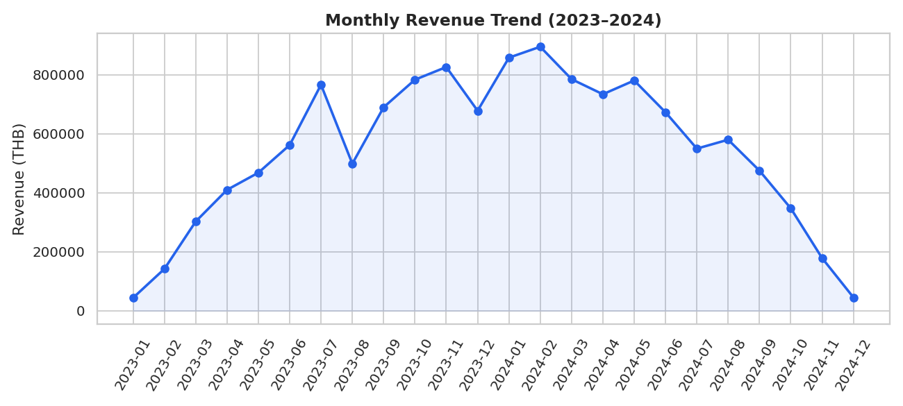
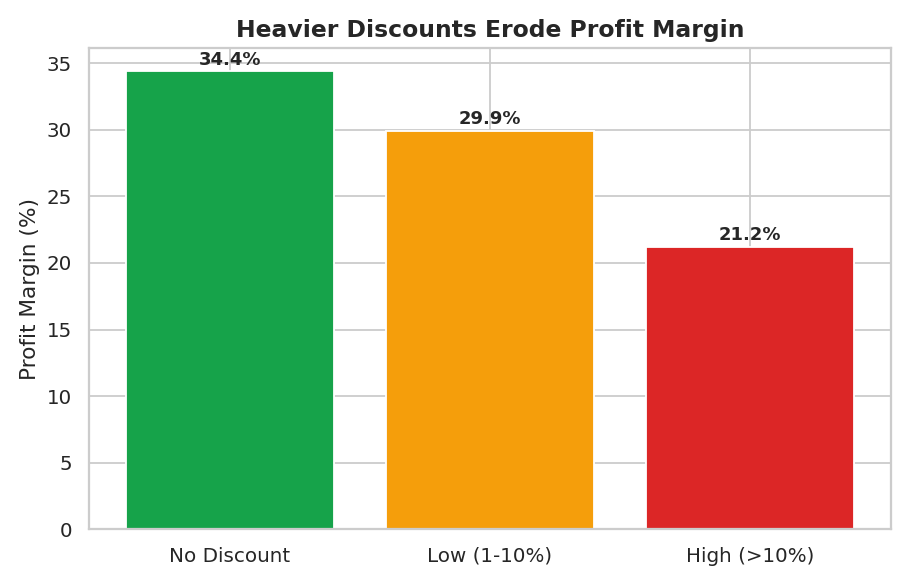
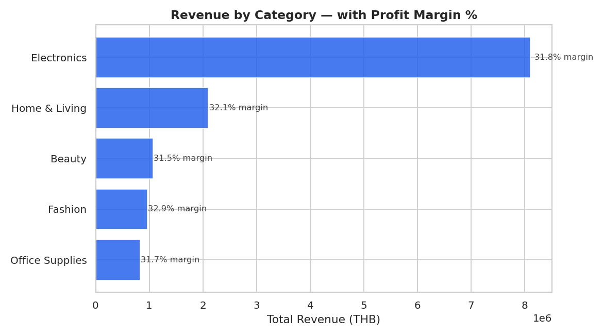
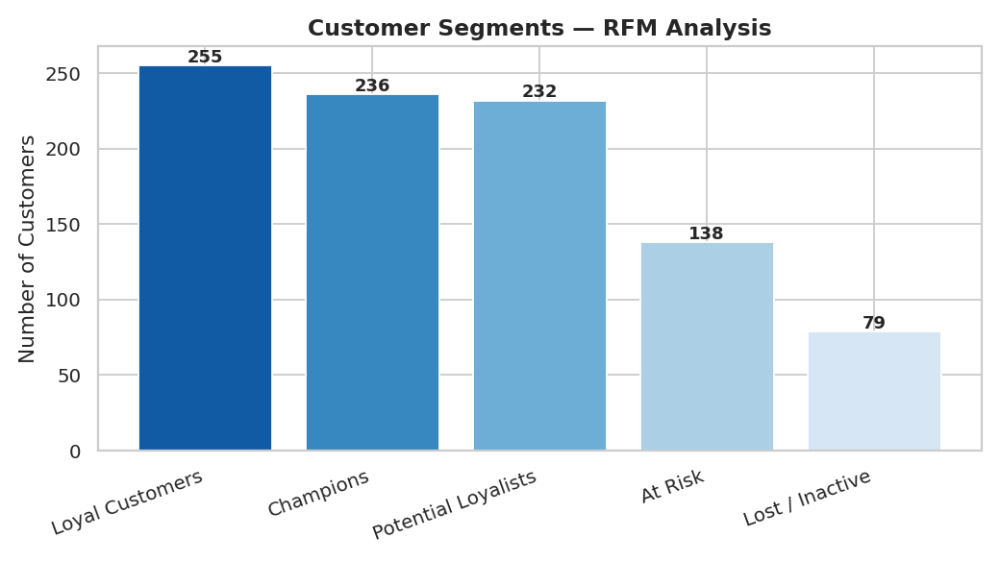

# 🛒 NextCart Retail Sales Analysis

**An end-to-end data analytics case study** — from messy raw data to SQL analysis, visual
storytelling, customer segmentation, and business recommendations.

[](https://www.python.org/)
[](https://www.sqlite.org/)
[](https://pandas.pydata.org/)
[]()

> [View the interactive dashboard](dashboard.html)** · [View the full analysis notebook](notebooks/NextCart_Sales_Analysis.ipynb)**

---

Business Problem

NextCart is a (fictional) Thailand-based online retailer selling Electronics, Fashion, Home &
Living, Beauty, and Office Supplies products nationwide. Leadership needs to understand:

1. Which products, regions, and customer segments actually drive profit — not just revenue
2. Whether the company's discounting strategy is helping or hurting margins
3. Which customers are most valuable, and which are at risk of churning

This project answers those questions through a full analyst workflow: **data cleaning → SQL
analysis → visualization → customer segmentation → business recommendations.**

> **Note on the data:** This dataset is synthetically generated to closely mirror a real
> e-commerce sales export (4,200+ orders, 950 customers, 2 years of transactions) — including
> realistic data quality problems (missing values, duplicates, inconsistent formatting, mixed
> date formats) — since no proprietary company dataset was available for a public portfolio.
> The cleaning and analysis methodology shown here is identical to what would be applied to
> real production data.

---

Preview

<table>
<tr>
<td width="50%"></td>
<td width="50%"></td>
</tr>
<tr>
<td width="50%"></td>
<td width="50%"></td>
</tr>
</table>

---

Key Findings

| Finding | Detail |
|---|---|
| Discounting is eroding margin** | Orders with no discount run a **34.4%** profit margin vs. just **21.2%** for discounts above 10% |
| Electronics drives revenue, not margin** | Electronics leads revenue, but Home & Living and Fashion post comparable or better margins |
| Margins are nationally consistent** | All 5 regions sit within a tight 30–33% margin band — growth gaps are about volume, not regional cost inefficiency |
| ~22% of customers drive outsized value** | RFM segmentation shows "Champions" + "Loyal Customers" (≈490 of 950) as the highest-value retention targets |
| Q4 2024 softened vs. Q4 2023** | Flagged as a question for stakeholders to investigate against marketing spend and inventory |

Full reasoning and recommendations for each finding are in [Section 7 of the
notebook](notebooks/NextCart_Sales_Analysis.ipynb).

---

Methodology & Tech Stack

| Stage | Tools | What it demonstrates |
|---|---|---|
| **Data Generation** | Python, NumPy, Pandas | Realistic synthetic data modeling |
| **Data Cleaning** | Pandas | Handling missing values, duplicates, inconsistent formatting, mixed date formats — with a documented [cleaning log](data/cleaning_log.txt) |
| **Business Analysis** | SQL (SQLite) | Aggregate queries, CTEs-style grouping, margin calculations — [`sql/sales_analysis.sql`](sql/sales_analysis.sql) |
| **Visualization** | Matplotlib, Seaborn | Publication-ready charts for stakeholder reporting |
| **Customer Segmentation** | Pandas (RFM) | Recency-Frequency-Monetary scoring for retention strategy |
| **Interactive Reporting** | HTML, CSS, Chart.js | A self-contained dashboard stakeholders can open without any tooling |

---

Repository Structure

```
nextcart-retail-analysis/
├── data/
│   ├── raw_sales_data.csv          # Synthetic raw export (with intentional data issues)
│   ├── cleaned_sales_data.csv      # Cleaned, analysis-ready dataset
│   ├── cleaning_log.txt            # Documented record of every cleaning step
│   ├── nextcart.db                 # SQLite database used for SQL analysis
│   ├── rfm_segments.csv            # Per-customer RFM scores & segment labels
│   └── rfm_segment_summary.csv     # Segment-level summary stats
├── sql/
│   ├── sales_analysis.sql          # 8 business questions answered in SQL
│   └── query_results.md            # Query outputs, captured for quick reading
├── scripts/
│   ├── 01_generate_data.py
│   ├── 02_clean_data.py
│   ├── 03_run_sql_analysis.py
│   ├── 04_eda_visualization.py
│   └── 05_build_notebook.py
├── notebooks/
│   └── NextCart_Sales_Analysis.ipynb   # Full narrative analysis, ready to view on GitHub
├── images/                         # Exported chart PNGs
├── dashboard.html                  # Interactive single-file dashboard (open in any browser)
└── README.md
```

---

How to Reproduce

```bash
git clone https://github.com/<your-username>/nextcart-retail-analysis.git
cd nextcart-retail-analysis
pip install pandas numpy matplotlib seaborn

python scripts/01_generate_data.py        # generates data/raw_sales_data.csv
python scripts/02_clean_data.py           # generates data/cleaned_sales_data.csv
python scripts/03_run_sql_analysis.py     # runs SQL queries, builds nextcart.db
python scripts/04_eda_visualization.py    # generates charts + RFM segments
```

Or just open [`notebooks/NextCart_Sales_Analysis.ipynb`](notebooks/NextCart_Sales_Analysis.ipynb)
— it already contains all outputs pre-rendered, no setup required to view.

To explore interactively, open [`dashboard.html`](dashboard.html) directly in any browser.

---

About

Built as a portfolio project to demonstrate an end-to-end Data/Business Analyst workflow:
problem framing, data cleaning, SQL, visualization, segmentation, and — most importantly —
turning numbers into a recommendation a stakeholder can act on.

**Contact:** *[Hattakorn Sawaengkarn, hattakorn.mep@gmail.com, and www.linkedin.com/in/hattakorn266]*
